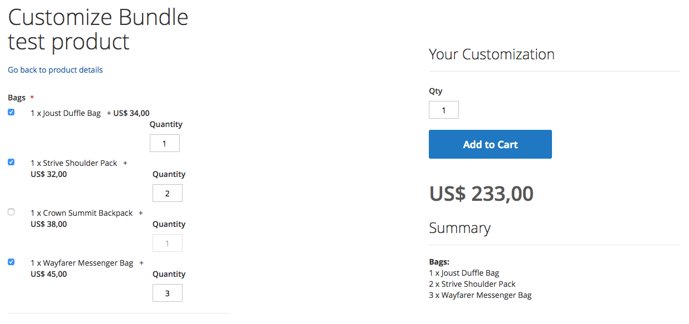

# Magento 2 BundleProduct Change Qty

**Allow customers to change the quantity on checkbox based bundle product options.**

Magento, by default, doesn't allow customers to change the quantity of checkbox options on Bundle products. This module changes that.

## Notes

- Magento doesn't allow this by intended design, for more information, please refer to this [issue](https://github.com/magento/magento2/issues/6873#issuecomment-286454358). This module changes a core mechanic.
- This module **does not** include any styling

## Requirements

- magento 2
- php: ~7.0

## Installation

- Add the module to composer:

        composer require itonomy/bundleproductchangeqty

- Run `bin/magento setup:upgrade` to enable the module.

- Clear cache
       
        'php bin/magento c:f'
        
## Usage

Checkbox template is overwritten, so with a default Magento installation it should look something like this.

## Changelog

- 1.0.0 First version module
- 1.0.1 Quantity input for bundle options with only a single product is now visible as well. This compliments the module by providing even more customizability. Issue: [#2](https://github.com/Itonomy/magento2-bundle-products-change-qty/issues/2)

## License

MIT
